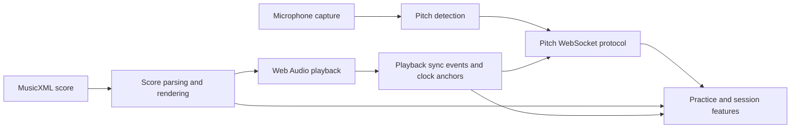

# Architecture and module boundaries

This document maps the boundaries that exist in the single `sing-attune`
repository today. It is a working aid for dependency direction and for a
possible open-core split; it is **not** a packaging, licensing, or migration
commitment. Until such a decision is made, all modules remain in this repository
and under its current licence.

## Current system map

The arrows show runtime data flow, not proposed package dependencies. The
frontend composition root in `frontend/src/features/` currently connects these
areas through the service modules in `frontend/src/services/`.

## Boundary inventory

### Pitch engine

- **Current interface:** `PitchPipeline.push(window, capture_time_ms)` accepts
  captured audio windows and calls an `on_frame(PitchFrame)` callback for valid
  estimates. `Engine`, `EngineRuntimeInfo`, and `resolve_engine_runtime()` expose
  engine selection. These APIs live in `backend/audio/pitch.py`; microphone
  acquisition is kept separately in `backend/audio/capture.py`.
- **Implementations today:** torchcrepe and librosa pYIN inference are private
  functions in the same module. `backend/audio/pipeline.py` owns playback state
  and composes `MicCapture` with `PitchPipeline`.
- **Boundary status:** this is a usable callback boundary, but it is not yet the
  pluggable `PitchEngine.estimate(...)` interface proposed by issue #377.
  Consumers must not treat the private inference functions as a stable API.

### Pitch-frame and synchronisation protocol

- **Current interface:** `/ws/pitch` sends raw `{t, midi, conf}` frames.
  `frontend/src/pitch/socket.ts` owns parsing and validation into `PitchFrame`;
  `backend/audio/pipeline.py` constructs the outgoing payload. REST playback
  transitions establish the time anchors described in
  `docs/sync-protocol.md`.
- **Clock contract:** backend frame time is measured in milliseconds from the
  playback epoch. Frontend projection is anchored to
  `AudioContext.currentTime`; wall-clock APIs are not part of the sync path.
  `frontend/src/services/playback-sync.ts` distributes typed transport events
  inside the frontend.
- **Boundary status:** the documented wire shape is the current source of truth,
  but frames are not yet versioned and construction is not yet isolated in a
  dedicated backend codec. Those changes belong to issue #378.

### Score parsing and rendering

- **Current interface:** `backend/score/parser.py::parse_musicxml()` produces the
  Pydantic `ScoreModel` from `backend/score/model.py`. In the frontend,
  `ScoreRenderer.load(file)` in `frontend/src/score/renderer.ts` returns the
  corresponding TypeScript `ScoreModel`; `loaded`, `scoreModel`,
  `setHighlightedPart()`, and `applyVisualTranspose()` are its consumer-facing
  surface. `frontend/src/services/score-session.ts` publishes the loaded
  renderer, cursor, model, and selected part to features.
- **Implementation detail:** OpenSheetMusicDisplay is directly owned by
  `frontend/src/score/renderer.ts` and `frontend/src/score/cursor.ts`. Some
  consumers still receive the concrete `ScoreRenderer`, and click-to-seek reads
  OSMD-shaped layout data through `frontend/src/score/click-seek.ts`.
- **Boundary status:** the renderer class is the present seam, not yet the narrow
  renderer interface proposed by issue #379. Score format analysis in
  `frontend/src/part-options.ts` and `frontend/src/score-analyser.ts` remains
  renderer-independent.

### Playback

- **Current interface:** `frontend/src/playback/engine.ts` schedules score notes
  against the shared `AudioContext`; `frontend/src/features/playback/` owns UI
  orchestration. `frontend/src/services/audio-context.ts` owns the browser audio
  context and soundfont lifecycle, while `playback-sync.ts`, `tempo.ts`, and
  `loop-region.ts` expose small state/event boundaries to other features.
- **Dependency rule:** playback may depend on the renderer-neutral score model
  and score timing functions. Pitch and practice modules should observe typed
  playback-sync events rather than control the playback engine directly.

### Practice and session

- **Current interface:** `frontend/src/practice/session-summary.ts` derives
  in-memory rehearsal summaries. `frontend/src/services/progress-history.ts`
  persists summary history in browser storage, and
  `frontend/src/services/session-recording.ts` records/export frames. The
  `ScoreSession` API in `frontend/src/services/score-session.ts` is the shared
  loaded-score context. Backend JSON session persistence lives behind
  `backend/session/store.py` and the session endpoints in `backend/main.py`.
- **Dependency rule:** practice code consumes `PitchFrame`, the score data model,
  and playback events. It should not import torchcrepe, librosa, OSMD, audio
  capture, or WebSocket implementation details.

## Open-core working classification

This table records plausible seams, not a promise that a module will move or
become proprietary.

| Area | Working classification | Reasoning |
|---|---|---|
| Audio capture and baseline pitch engines | **Core** | Local, inspectable pitch feedback is the product's fundamental capability; keeping a complete baseline avoids an unusable shell. |
| Pitch-frame schema and sync rules | **Core** | Both local and hosted implementations need an open interoperability contract and stable clock semantics. |
| MusicXML parsing, score model, timing, and baseline OSMD renderer | **Core** | Importing and viewing a score is required for local practice, and the format/model boundary should remain portable. |
| Local Web Audio playback and transport | **Core** | A fully local rehearsal loop must work without a hosted service or account. |
| Local practice summaries and session storage | **Core** | Users should retain basic feedback and ownership of locally generated rehearsal data. |
| Alternate high-accuracy pitch engines | **Possible premium implementation** | A model can be swapped behind the future pitch-engine interface without changing capture or frame consumers. |
| Hosted sync, collaboration, and cross-device history | **Possible hosted service** | These add network operations, durable multi-user storage, and service costs while the local protocol remains usable. |
| Advanced analytics or coaching | **Possible premium feature** | It can consume the same core score, pitch-frame, and session contracts without hiding baseline feedback. |

## Rules for keeping the seams honest

1. Keep third-party engine details behind their owning boundary: torchcrepe and
   librosa in backend pitch code, OSMD in frontend score code, and Web Audio in
   playback/audio services.
2. Pass typed domain values (`PitchFrame`, `ScoreModel`, playback events) across
   boundaries instead of library objects or raw JSON.
3. Treat `docs/sync-protocol.md` as authoritative until issue #378 introduces a
   versioned schema; update documentation and both endpoints together.
4. Do not create `core` and `premium` directories merely to match this map. A
   physical split should happen only after the interfaces in issues #377–#379
   exist and real implementations demonstrate that the seams are sufficient.

## Related boundary work

- #377 — pluggable pitch-engine interface
- #378 — versioned pitch-frame WebSocket schema
- #379 — stable score-renderer interface
- #380 — this architecture map

